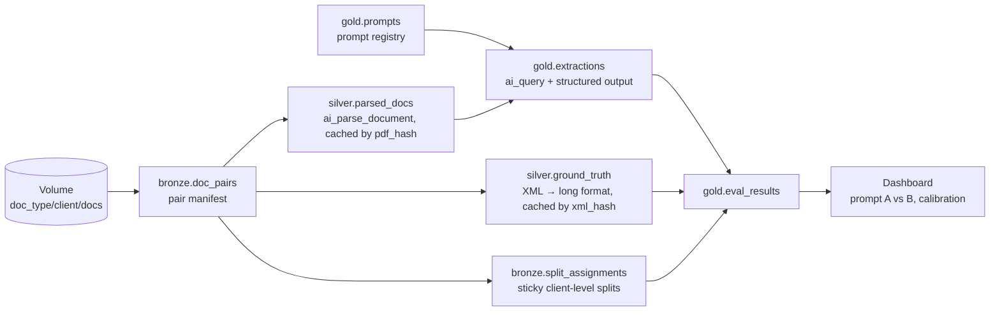

# tars v2 — AI extraction & evaluation pipeline for tax documents

## Context

Non-coders need to run AI extraction over tax documents in Databricks and iterate on
prompts without writing code. Source material lives in a Unity Catalog volume organized
as `<doc_type>/<client>/<documents>`, where a folder that contains both a PDF and an XML
(matched by shared filename substring) constitutes a **pair**: the PDF is the input, the
XML is the ground truth. Pair-matching logic already exists and produces DataFrames.

The pipeline ahead: `ai_parse_document` on the PDFs, XML parsing of the ground truth,
LLM extraction with **per-field confidence scores and citations**, and an evaluation loop
so prompt changes can be measured instead of eyeballed. Hard requirements:

- **Never reprocess** work that's already done (parsing and extraction both cost money).
- **Train/validate/test independence** — iterate prompts on a small subset, keep a
  holdout that prompt decisions never touch.
- Results comparable **across prompt versions**, so iteration is measurable.

One framing note: there is no gradient training here, so "train" really means
**prompt-dev** — the small set you look at while writing prompts. The three splits are
called `dev` / `val` / `test` throughout to keep that honest.

## Architecture at a glance



Every arrow is incremental: each stage anti-joins its target table on the relevant key
and only processes what's new. Deleting a downstream table never re-triggers upstream
cost.

## 1. Pair manifest — `bronze.doc_pairs`

Persist the matched pairs to Delta **once**, then treat the manifest as the system of
record. Nothing downstream ever touches paths or the volume listing again.

| column | type | notes |
|---|---|---|
| `pair_id` | STRING | = `pdf_hash` (stable identity of the pair) |
| `doc_type` | STRING | from path segment 1 |
| `client` | STRING | from path segment 2 |
| `pdf_path`, `xml_path` | STRING | volume paths |
| `pdf_hash` | STRING | sha256 of PDF **content** |
| `xml_hash` | STRING | sha256 of XML content |
| `pdf_size_bytes`, `pdf_modified_at` | | cheap pre-filter before hashing |
| `discovered_at` | TIMESTAMP | |

Design points:

- **Key on content hash, not path.** A renamed or moved file doesn't reprocess; a file
  replaced in place (new hash) correctly does. Use `pdf_modified_at` + size as a cheap
  short-circuit so re-listing the volume doesn't re-hash unchanged files.
- **Refresh = MERGE**, matched on `pdf_path`: insert new pairs, update hashes when
  content changed. Run as a scheduled or on-demand "discover new documents" job — the
  only job that reads the volume tree.
- Unpaired files (PDF without XML, or vice versa) go to a companion `bronze.unpaired`
  table for visibility, not silently dropped.

## 2. Splits — `bronze.split_assignments`

**The unit of assignment is the client, not the document.** Documents from one client
share a preparer, formatting, and quirks; splitting at document level leaks that style
into the holdout and inflates every number. If the same client name appears under
multiple doc types, it still lands in exactly one split.

| column | type | notes |
|---|---|---|
| `client` | STRING | PK |
| `split` | STRING | `dev` \| `val` \| `test` |
| `assigned_at` | TIMESTAMP | |
| `method` | STRING | e.g. `xxhash64-v1` |

- **Deterministic and sticky:** `bucket = abs(xxhash64(client)) % 100`; e.g. bucket
  < 10 → `dev`, < 30 → `val`, else `test` (10 / 20 / 70 — tune to taste, small dev is
  the point). New clients arriving later get assigned by the same rule, so the table
  only ever grows — assignments never reshuffle.
- Persisting (rather than computing the hash on the fly) makes the split auditable and
  lets you manually pin a pathological client if needed, with `method = 'manual'`.
- **Access rule, enforced by the jobs, not by convention:** the prompt-iteration job
  hard-filters to `dev` (and optionally `val`); only a separate, manually-triggered
  final-eval job may read `test`. Non-coders physically cannot burn the holdout by
  clicking the wrong button.

## 3. Parsing layer (expensive — cache aggressively)

### `silver.parsed_docs` — one row per unique PDF

| column | type | notes |
|---|---|---|
| `pdf_hash` | STRING | PK |
| `parse_output` | VARIANT | full `ai_parse_document` JSON (elements, pages, bboxes) |
| `parsed_text` | STRING | concatenated text with page markers, extraction input |
| `page_count` | INT | |
| `parse_version` | STRING | pin/record the parser version — output drifts across releases |
| `status`, `error` | | `ok` \| `failed`; failures retried explicitly, not automatically forever |
| `parsed_at` | TIMESTAMP | |

Incremental rule: `doc_pairs ANTI JOIN parsed_docs ON pdf_hash` → parse only those.
Keep the **full** parse JSON, not just text: citations reference page/element IDs, and
keeping it means never re-parsing when the extraction schema evolves.

### `silver.ground_truth` — XML flattened to long format

| column | type |
|---|---|
| `pair_id`, `xml_hash` | STRING |
| `field_name` | STRING |
| `field_value` | STRING |
| `source_xpath` | STRING |

Long format makes evaluation a plain join, and tolerates different doc types having
different field sets. Re-parse only rows whose `xml_hash` isn't already present — XML
parsing is cheap, but the same idempotency pattern keeps the whole system uniform.

Field-name normalization (XML tag → canonical field name per doc type) lives in a small
mapping table, `silver.field_map(doc_type, xml_field, canonical_field)`, editable
without code changes.

## 4. Extraction layer — `ai_query`, not `ai_extract`

`ai_extract(content, array('field', ...))` accepts only field names: **no custom
prompt, no confidence, no citations.** All three requirements point to
`ai_query` with structured output:

```sql
ai_query(
  'databricks-claude-sonnet-4-5',
  p.prompt_text || '\n\n<document>\n' || d.parsed_text || '\n</document>',
  responseFormat => p.response_schema   -- JSON schema, stored in the prompt registry
)
```

Response schema shape (per doc type, stored alongside the prompt):

```json
{ "type": "json_schema", "json_schema": { "name": "tax_extraction", "schema": {
  "type": "object", "properties": { "fields": { "type": "array", "items": {
    "type": "object", "properties": {
      "name":       { "type": "string" },
      "value":      { "type": ["string", "null"] },
      "confidence": { "type": "number", "description": "0.0-1.0" },
      "evidence":   { "type": "string", "description": "verbatim quote from the document" },
      "page":       { "type": "integer" }
    }, "required": ["name", "value", "confidence", "evidence", "page"]
  } } } } } }
```

### `gold.prompts` — the registry non-coders edit

| column | type | notes |
|---|---|---|
| `prompt_id` | STRING | PK, e.g. `1040-v3` |
| `doc_type` | STRING | |
| `prompt_text` | STRING | |
| `response_schema` | STRING | JSON schema above |
| `model` | STRING | endpoint name |
| `created_by`, `created_at`, `notes` | | |

Prompts are **append-only**: a change is a new `prompt_id`, never an edit in place —
that's what makes results comparable and cache keys stable.

### `gold.extractions` — one row per (document, prompt, field)

| column | type | notes |
|---|---|---|
| `pdf_hash` | STRING | ┐ |
| `prompt_id` | STRING | ├ uniqueness key |
| `field_name` | STRING | ┘ |
| `pair_id`, `doc_type`, `split` | | denormalized for easy filtering |
| `value` | STRING | |
| `confidence` | DOUBLE | model-reported, 0–1 |
| `evidence_text` | STRING | verbatim quote |
| `evidence_page` | INT | |
| `citation_verified` | BOOLEAN | see below |
| `model`, `extracted_at` | | |

Incremental rule: for the selected `prompt_id` and split, run only pairs with no row in
`extractions` for that `(pdf_hash, prompt_id)`. Old prompt versions' results stay put —
re-running prompt v2 after trying v3 costs nothing.

### Citation verification — trust but check

Self-reported citations hallucinate. After extraction, verify mechanically:
whitespace-normalize `evidence_text` and check it appears as a substring of the parsed
text for `evidence_page` (fall back to whole-doc match, recording the looser result).
Set `citation_verified` accordingly. In the review UI, an unverified citation is a red
flag on the row regardless of confidence.

The same caveat applies to `confidence`: it's the model's self-assessment, useful only
once **calibrated** — which is exactly what the eval layer measures.

## 5. Evaluation — `gold.eval_results`

Join `extractions` to `ground_truth` on `(pair_id, field_name)`, aggregate per
`(prompt_id, split, doc_type, field_name)`:

- `n`, `exact_match_rate`, `normalized_match_rate` (case/whitespace/number-format
  normalization — money and dates need canonicalization before comparing)
- `null_rate` (model abstained), `gt_coverage` (field present in ground truth)
- `avg_confidence`, plus a calibration curve: bucket confidence into deciles and compute
  accuracy per bucket. If 0.9-confidence answers are right 60% of the time, the
  confidence threshold non-coders use for "auto-accept vs human review" must reflect
  that.

A Databricks AI/BI dashboard on this table gives the iteration surface: prompt A vs
prompt B per field, per doc type, on `val` — plus the calibration plot.

## 6. The iteration loop (what a non-coder actually does)

1. **Discover** (scheduled): volume → `doc_pairs` → new PDFs parsed → new XMLs parsed.
   Splits auto-assigned for new clients.
2. **Write a prompt**: add a row to `gold.prompts` via a small widget notebook or
   Databricks App form (pick doc type, paste prompt, auto-versioned id).
3. **Run extraction** (job with one dropdown: `prompt_id`): extracts the **dev** split
   only, skipping anything already extracted for that prompt.
4. **Look at the dashboard**: field-level accuracy vs the previous prompt, citation
   verification rate, calibration. Iterate → back to step 2.
5. **Promote**: when a prompt wins on dev, run the same job against `val` to confirm the
   win generalizes. Iterate on dev, *confirm* on val.
6. **Final eval** (separate, manually-triggered, ideally rare): run the chosen prompt on
   `test`. This is the number you report.

## 7. No-reprocess rules, in one table

| stage | cache key | re-runs only when |
|---|---|---|
| pair discovery | `pdf_path` (MERGE) | file content changed (hash differs) |
| `ai_parse_document` | `pdf_hash` | new/changed PDF, or deliberate `parse_version` bump |
| XML ground truth | `xml_hash` | new/changed XML |
| extraction | `(pdf_hash, prompt_id)` | new document or new prompt version |
| eval | derived | cheap — recompute freely |

## 8. Build order

1. `bronze.doc_pairs` + `bronze.split_assignments` (port the existing matching logic,
   add hashing + MERGE) — this answers "get the mappings into Delta in one go": yes.
2. `silver.parsed_docs` incremental job.
3. `silver.ground_truth` + `field_map` for the first doc type.
4. `gold.prompts` + extraction job with structured output + citation verification.
5. `gold.eval_results` + dashboard.
6. Widget notebook / App front-end for steps 2–4 of the iteration loop.

## Open items (defaults chosen, revisit if wrong)

- **Split ratios** default 10/20/70 (dev/val/test); with few clients per doc type,
  check per-doc-type balance after assignment and pin manually if a doc type has no
  dev representation.
- **Model choice** lives in the prompt registry, so comparing models is the same
  workflow as comparing prompts.
- **Long documents**: if `parsed_text` exceeds the context window, chunk by page ranges
  at extraction time — the stored parse output already supports this without re-parsing.
